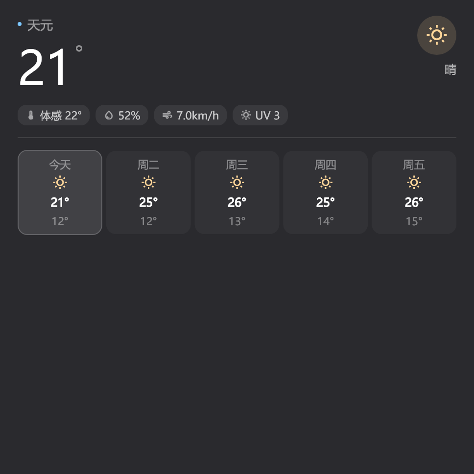
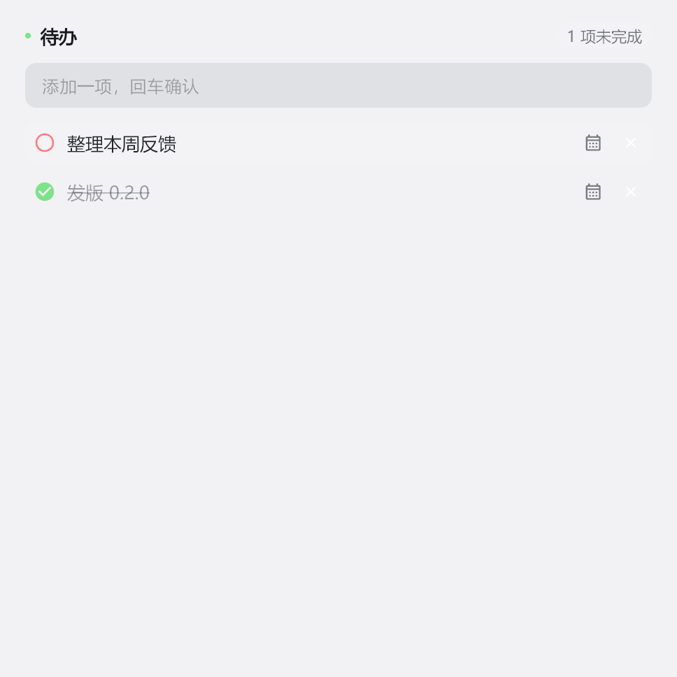
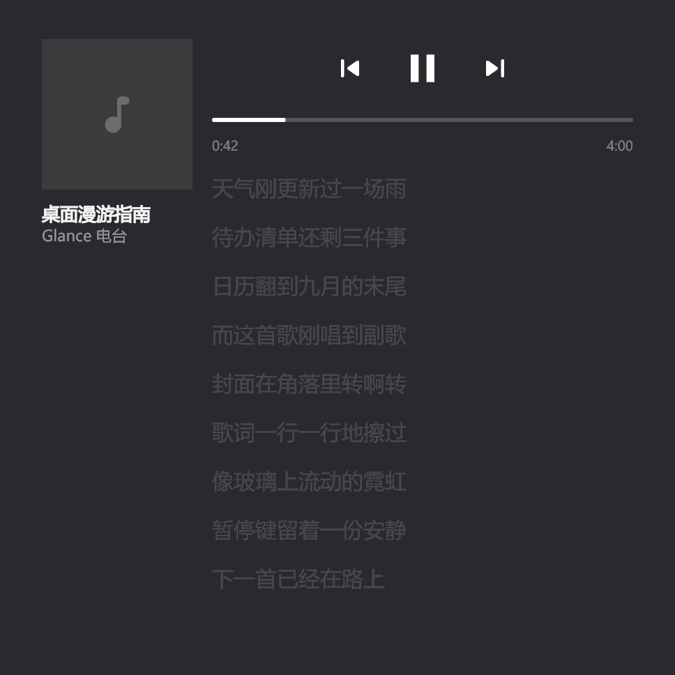

# Glance · 一瞥

Windows 桌面磁贴。把时钟、天气、日历、待办、歌词贴在壁纸上，窗口盖过去它们就在下面待着。

<p align="center">
  
  
  
  
  
</p>

## 这是什么

一个常驻桌面的组件层。卡片不是窗口，磁贴窗口是一整块盖住虚拟屏的透明层，
永远待在 Z 序最底 —— 浏览器、IDE 盖上来的时候你看不见它，但窗口一挪开，
它们就还在那儿。`Win+D` 之后也一样会归位。

拖动、对齐吸附、缩放都在本地算，没有常驻服务，不联网（除了天气和歌词自己要取数据）。

## 组件

| | |
|---|---|
| **时钟** | 24/12 小时制，可选秒 |
| **天气** | 小米天气实况 + 5 日预报，IP 自动定位或手填城市（城市检索走中国天气网，地理编码走 [Open-Meteo](https://open-meteo.com)） |
| **日历** | 月历，带农历、二十四节气、节假日，点某天看倒计时 |
| **待办** | 本地清单，行内定截止日期 |
| **歌词** | 读系统正在播放的那首歌，滚动歌词 + 封面 + 进度控制 |

歌词的词源是并行汇总 **网易云 / QQ 音乐 / 酷狗**，三方候选一起打分选出最匹配的
一首（LRCLIB 兜底）。评分不只是比歌名 —— 歌手、时长一起参与，
歌名完全对不上会直接否决，因为翻唱专辑最爱在这时候骗过搜索。

## 几个实现上的选择

**卡片记住「家在哪块屏的哪个位置」。** 只存窗口坐标是不够的：窗口原点就是虚拟屏原点，
而虚拟屏原点会动（在主屏左边接一块屏，原点就从 0 变成 -1920），存下来的坐标一夜之间
全部指偏。所以每张卡额外记下自己所在屏的设备名和屏内相对位置，改分辨率、改缩放、
插拔显示器之后按这个钉回原处。

**没认过家的老卡片不会被乱挪。** 没存锚点时按当前位置认领一块屏，位置不动 ——
迁移不能变成"用户没动过的东西自己跑了"。

**位置和家一起存。** 拖拽松手时先认家再落盘。只存坐标的话，下次布局一变就失去了还原依据。

**QQ 音乐限流是静默的。** 它返回 HTTP 200、code=0，只是 `songs` 变成空数组，
响应体从 42KB 缩到 900 字节。不专门判一下就会表现成"搜不到"。

## 自己构建

需要 **Flutter 3.x**（Dart SDK ≥ 3.12）和 **Visual Studio 2022** 的桌面 C++ 工作负载。

```powershell
flutter pub get
flutter build windows --release --no-pub
```

`--no-pub` 别省。产物在 `build\windows\x64\runner\Release\`，整个文件夹就是发布版。

打便携包：

```powershell
tool\build_release.bat        # -> installer\out\Glance-<版本>-便携版.exe
```

版本号唯一来源是 `pubspec.yaml` 里的 `version:`。更新日志由 git-cliff 依据提交信息生成
（见 `tool\cliff.toml`）。

## 跑测试

```powershell
flutter test --no-pub
```

`test/` 下面有几个文件虽然顶着 `_test.dart` 的后缀，但它们不是断言测试 ——
是**生成工具**（出 `assets/previews/` 里的预览图、关于页的 logo）和**联网自证**。
`dart_test.yaml` 里用 `gen` / `live` 两个 tag 默认跳过，不隔离的话每跑一次测试
都会重新生成 6 张提交进仓库的素材图，`git status` 永远是脏的。

手动跑的时候记得带 `--run-skipped`：

```powershell
flutter test --tags gen  --run-skipped   # 预览图 + logo
flutter test --tags live --run-skipped   # 联网端到端取词验证
```

`--run-skipped` 不能省：`skip` 是无条件跳过，`--tags` 只是筛选，两者独立互不覆盖。
只写 `--tags gen` 会得到一句 `All tests skipped`。

改了组件外观之后重新生成预览图：

```powershell
flutter test --tags gen --run-skipped
```

## 数据都在哪

```
userdata/
  config.json        设置与卡片布局
  plugindata/        各插件自己的数据，一插件一文件
  logs/              日志，按天分文件
```

整个 `userdata/` 拷走就是搬家。

## 托盘

- **左键** 打开设置
- **右键** 快捷菜单（退出、开机自启等）

---

## 出身

Glance 脱胎于 [Vectra](https://github.com/MacroSTAR-Org/Vectra)，算是从那儿
"离家出走"出来的一个独立分支。

天气数据来自 [Open-Meteo](https://open-meteo.com)，城市检索走中国天气网。

跟上游分家之后，这边把歌词做了大改：词源从单一换成网易云 / QQ 音乐 / 酷狗
三源综合取舍。Vectra 那边的 JS 插件体系和 AI 侧边栏**目前还没跟过来**，
内置组件是 Flutter 原生实现的。

如果你的改动和上游能对上，欢迎回上游提 PR；只属于 Glance 的部分就留在这边。

## 致谢

- [Vectra](https://github.com/MacroSTAR-Org/Vectra) —— 一切的起点
- [Lyricify](https://github.com/Safetyplan/Lyricify-Lyrics-Highlighter) —— 歌词音节级时间轴的思路来源